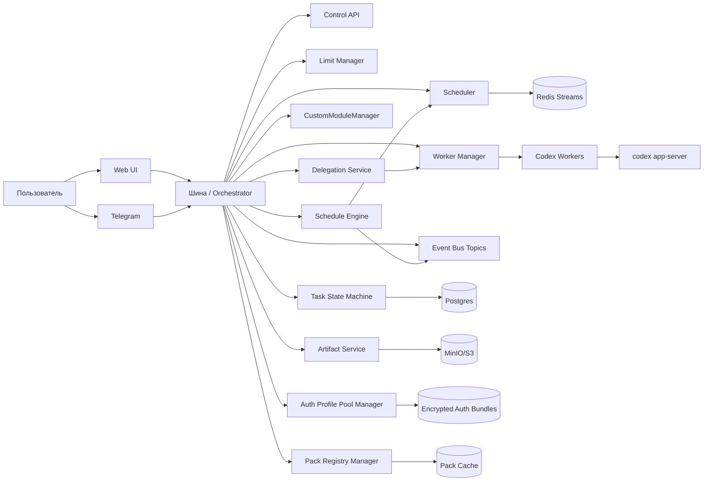

# SCH-01: System Context

## Цель
Подтвердить границы системы и роли внешних/внутренних компонентов.

## Что валидирует
- Границы control plane и data plane.
- Каналы управления (Web, Telegram, API).
- Основные зависимости хранения и runtime.
- Наличие Pack Registry, Delegation Service и Schedule Engine.

## Таблица проверки компонентов
| Контур | Компонент | Обязательная функция |
|---|---|---|
| Control plane | Scheduler | Guard-решения и выдача задач |
| Control plane | CustomModuleManager | Trigger -> ModuleDecision |
| Control plane | Auth Profile Pool Manager | Активный профиль и switch история |
| Control plane | Pack Registry Manager | register/validate/materialize/rotate |
| Control plane | Delegation Service | bus-only discovery/dispatch/result |
| Control plane | Schedule Engine | Hybrid Rule Model + overlap/misfire policy |
| Data plane | Workers | Исполнение turn и сбор артефактов |
| Storage | Postgres | Состояния задач, audit, switch события |
| Storage | Redis Streams | Очередь/события/locks |
| Storage | MinIO/S3 | Артефакты и логи |

## Проверка точности
- [ ] Все перечисленные компоненты отражены в ТЗ (разделы 5/6/12/13/14).
- [ ] Нет компонента, который противоречит OpenAPI или Prisma моделям.
- [ ] Ясно, какие узлы являются внешними, а какие внутренними.

## Границы интерпретации
- Схема не фиксирует внутреннюю реализацию модулей (только системные связи).
- Схема не описывает sequence выполнения (для этого SCH-04).

## Open questions (локально)
- Нужен ли отдельный event-bridge слой при росте beyond Redis Streams?
