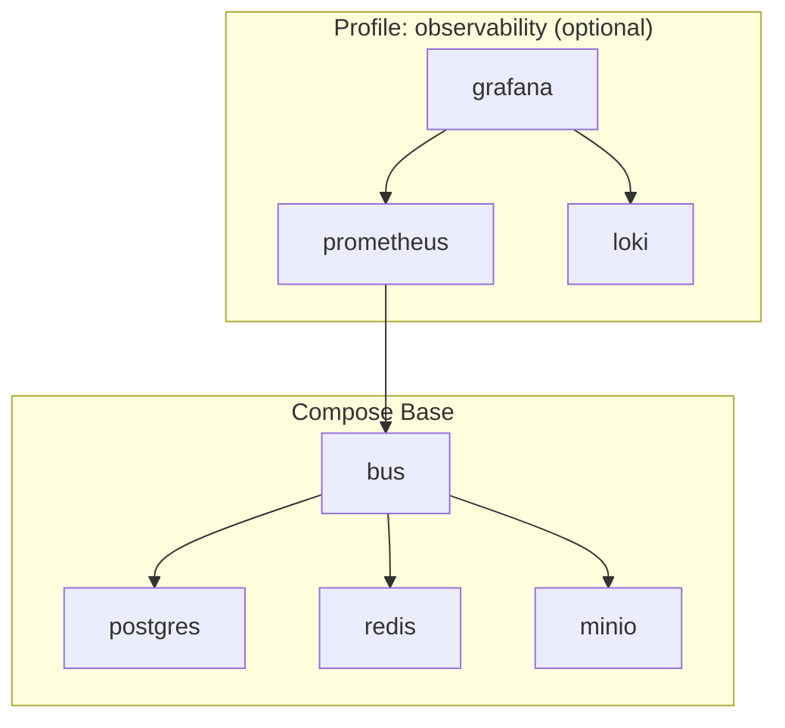

# SCH-02: Container Deployment (Compose)

## Цель
Зафиксировать каноничную топологию запуска для любого ПК и optional observability.

## Что валидирует
- Базовый профиль compose: bus + postgres + redis + minio.
- Optional profile: prometheus + grafana + loki.
- Volume/healthcheck зависимости.

## Таблица сервисов
| Сервис | Профиль | Обязателен в MVP | Назначение |
|---|---|---|---|
| bus | base | Да | Control plane API/runtime |
| postgres | base | Да | Состояния, аудит, метаданные |
| redis | base | Да | Queue/events/locks |
| minio | base | Да | Артефакты |
| prometheus | observability | Нет | Метрики |
| grafana | observability | Нет | Дашборды |
| loki | observability | Нет | Централизованные логи |

## Проверка точности
- [ ] Схема совпадает с `/docs/docker/docker-compose.example.yml`.
- [ ] Базовый профиль поднимается без observability.
- [ ] Optional профиль не ломает базовую работоспособность.

## Границы интерпретации
- Не фиксирует конкретные CPU/RAM лимиты контейнеров.
- Не описывает продовую оркестрацию beyond Compose.

## Open questions (локально)
- Добавлять ли отдельный reverse-proxy сервис в canonical compose v1?
