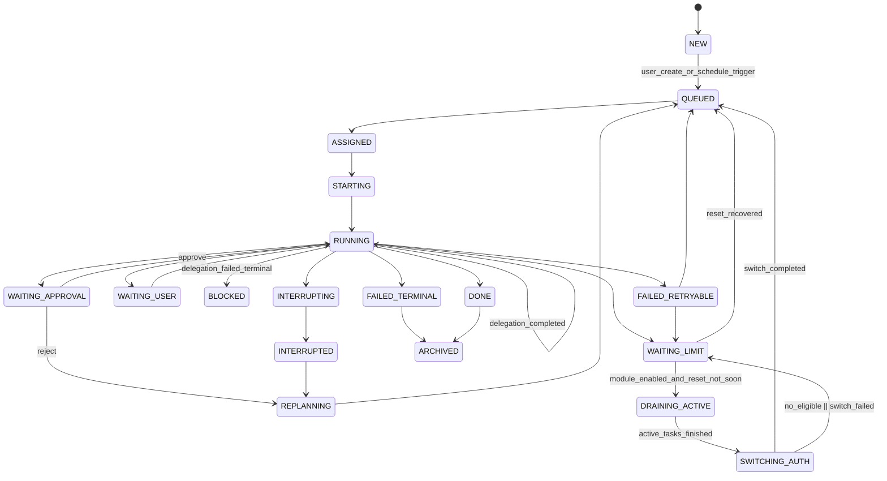

# SCH-03: Task State Machine

## Цель
Подтвердить полный набор состояний и переходов с учетом auth-switch режима.

## Что валидирует
- Наличие switch-состояний `WAITING_LIMIT`, `DRAINING_ACTIVE`, `SWITCHING_AUTH`.
- Наличие переходов ошибок и recovery-процедуры после рестарта.
- Отсутствие "залипающих" состояний без выхода.
- Совместимость с schedule-trigger и delegation flow.

## Таблица критичных переходов
| Откуда | Куда | Триггер | Guard |
|---|---|---|---|
| RUNNING | WAITING_LIMIT | limit pressure | для новых задач hold |
| WAITING_LIMIT | DRAINING_ACTIVE | модуль включен | reset >= 3h |
| DRAINING_ACTIVE | SWITCHING_AUTH | drain завершен | active_tasks = 0 |
| SWITCHING_AUTH | QUEUED | switch успех | warm workers recycled |
| SWITCHING_AUTH | WAITING_LIMIT | switch невозможен | no eligible profile |
| NEW | QUEUED | schedule trigger | rule matched + rule enabled |
| RUNNING | RUNNING | delegation completed | bus reply received |
| RUNNING | BLOCKED | delegation failed (terminal) | parent-task policy after retry budget exhaustion |

## Проверка точности
- [ ] Состояния и переходы совпадают с ТЗ и OpenAPI status enum.
- [ ] Есть явные выходы для `WAITING_APPROVAL`, `WAITING_USER`, `FAILED_TERMINAL`.
- [ ] Switch-ветка не нарушает правило "активные задачи не прерывать".

## Границы интерпретации
- Схема не задает retry-параметры (они описаны в module/runtime контрактах).
- Схема не определяет приоритеты очереди (это SCH-05).
- Recovery после рестарта выполняется как boot/reconcile-процедура без отдельного state.

## Локальное решение
- Отдельный state `RECOVERY_IN_PROGRESS` в MVP не вводится.
