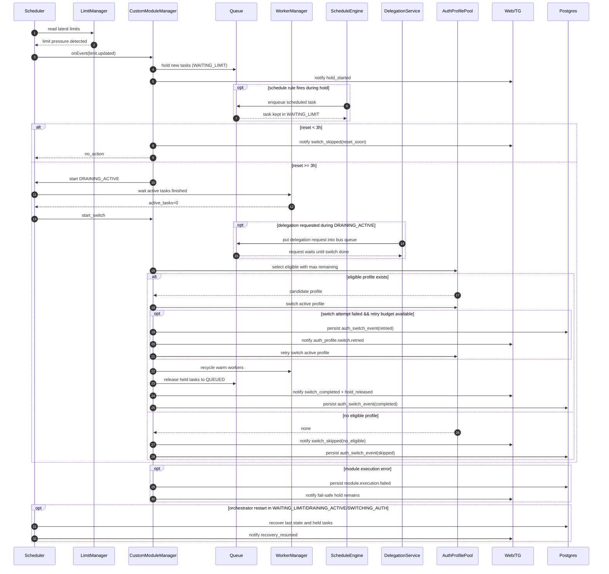

# SCH-04: Auth Switch Sequence

## Цель
Визуально подтвердить поведение hold/drain/switch/release с edge-case ветками.

## Что валидирует
- Последовательность действий при limit pressure.
- Ветки `reset-soon`, `no eligible profile`, `restart recovery`.
- Fail-safe поведение при ошибке модуля.
- Поведение schedule/delegation в период hold/switch.
- Retry-ветку переключения и событие `auth_profile.switch.retried`.

## Таблица edge-case решений
| Сценарий | Ожидаемое поведение | Потеря задач допустима |
|---|---|---|
| reset-soon guard | switch пропускается, остаемся в WAITING_LIMIT | Нет |
| no eligible profile | switch не выполняется, hold сохраняется | Нет |
| module failed | fail-safe, очередь не теряется | Нет |
| switch retried | фиксируется `auth_profile.switch.retried`, затем продолжение switch flow | Нет |
| restart mid-switch | recovery из БД + продолжение | Нет |
| schedule fired while hold | scheduled task удерживается до release | Нет |
| delegation during draining | запрос делегации не теряется, исполняется после switch | Нет |

## Проверка точности
- [ ] Выбор профиля: max remaining limits.
- [ ] Активные задачи не прерываются.
- [ ] После switch warm workers перезапускаются.
- [ ] Все ключевые уведомления в Web/TG присутствуют.
- [ ] Retry switch фиксируется отдельным событием `auth_profile.switch.retried`.

## Границы интерпретации
- Не фиксирует внутренний формат лимитов provider API.
- Не описывает UI макеты уведомлений.

## Локальное решение
- В MVP используется отдельное событие/уведомление `auth_profile.switch.retried`.
