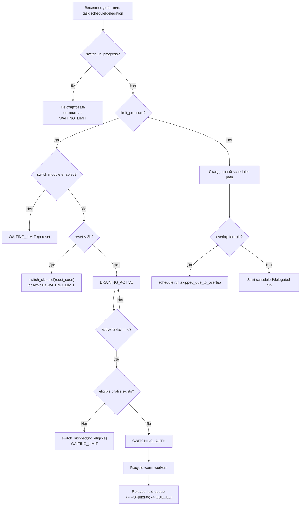

# SCH-05: Scheduler Guards

## Цель
Зафиксировать decision-логику scheduler при лимитах и переключении профиля.

## Что валидирует
- При switch нет новых стартов.
- Включение hold для новых задач при pressure.
- Правильные развилки reset/no-eligible.
- Совместимость с scheduled trigger и delegation dispatch.
- Политику release held queue в MVP: `FIFO + priority`.

## Decision table
| Условие | Решение scheduler | Событие |
|---|---|---|
| switch_in_progress=true | не стартовать новые задачи | `task.waiting_limit` |
| limit_pressure=true && module_disabled | hold до reset | `queue.hold_started` |
| limit_pressure=true && reset<3h | switch skipped | `auth_profile.switch.skipped` |
| limit_pressure=true && eligible=false | hold сохраняется | `auth_profile.switch.skipped` |
| switch success | release hold по `FIFO+priority` | `queue.hold_released` |
| schedule overlap=true | пропустить run | `schedule.run.skipped_due_to_overlap` |
| delegation dispatch | старт через bus queue | `agent.delegation.requested` |

## Проверка точности
- [ ] Нет пути, где scheduler стартует новые задачи во время switch.
- [ ] Все ветки приводят к терминальному decision.
- [ ] Логика совпадает с SCH-04 и state machine.

## Границы интерпретации
- Не задает конкретный алгоритм приоритизации задач (только guard-блоки).

## Локальное решение
- В MVP используется release held queue по `FIFO+priority`, без role-aware guard.
