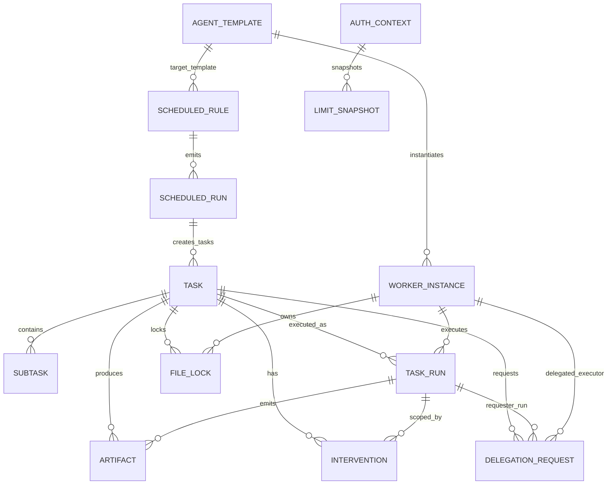

# SCH-06: ERD Core

## Цель
Подтвердить core-модель данных выполнения задач и артефактов.

## Что валидирует
- Основные сущности pipeline и связи.
- Где фиксируются интервенции, лимиты, логи и артефакты.
- Как связаны scheduling и delegation с задачами и воркерами.

## Таблица сущностей core
| Сущность | Роль |
|---|---|
| Task | Карточка и состояние задачи |
| Subtask | Декомпозиция и dependency |
| TaskRun | Конкретный запуск worker по задаче |
| Artifact | Diff/log/report/summary |
| Intervention | Действия пользователя/оператора |
| WorkerInstance | Runtime инстанс агента |
| LimitSnapshot | Состояние лимитов по auth context |
| FileLock | Блокировки конфликтных путей |
| ScheduledRule | Гибридное правило запуска агента |
| ScheduledRun | Конкретный запуск правила и его исход |
| DelegationRequest | Межагентный запрос на capability через шину |

## Проверка точности
- [ ] Связи соответствуют Prisma/SQL.
- [ ] Нету core сущности из ТЗ, отсутствующей на ERD.
- [ ] Кардинальности не противоречат pipeline логике.
- [ ] ScheduledRun и DelegationRequest связаны с task/run без разрыва traceability.

## Границы интерпретации
- Не показывает служебные поля (timestamps, checksum, meta_json).
- Не показывает индексы/уникальные ограничения (они в SQL/Prisma).

## Open questions (локально)
- Нужна ли отдельная сущность QueueItem в core-модели?
