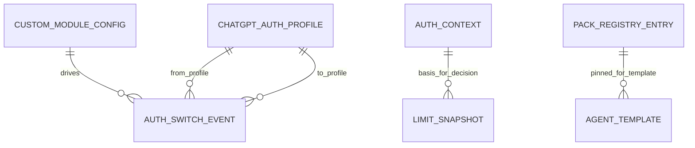

# SCH-07: ERD Auth + Modules

## Цель
Подтвердить модель кастомных модулей и пула ChatGPT auth-профилей.

## Что валидирует
- Конфиг модуля switch.
- Lifecycle auth-профилей.
- История switch-событий.
- Lifecycle role/capability packs.

## Таблица сущностей подсистемы
| Сущность | Назначение |
|---|---|
| CustomModuleConfig | enable/config/thresholds модуля |
| ChatGptAuthProfile | активные/неактивные/blocked профили |
| AuthSwitchEvent | история start/completed/failed/skipped |
| LimitSnapshot | фактические лимиты для decision |
| PackRegistryEntry | registry pinned pack-версий (git/zip, materialize status) |

## Проверка точности
- [ ] Поле `module_key` однозначно связывает switch с модулем.
- [ ] Есть возможность аудита `from -> to` профилей.
- [ ] Сценарий no-eligible фиксируется как `skipped`.
- [ ] Для pack registry зафиксирован `pinned_version` и `materialize_status`.

## Границы интерпретации
- Не отражает физический layout encrypted bundle storage.
- Не описывает UI-операции активации/деактивации (только data-связи).

## Open questions (локально)
- Нужен ли отдельный журнал health-check статуса auth-профилей?
