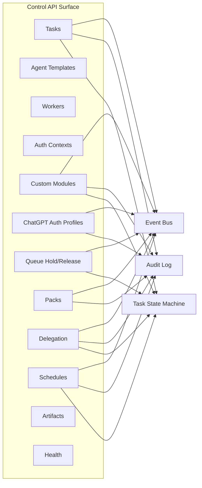

# SCH-08: API Surface Map

## Цель
Свести API-группы к событиям, аудиту и влиянию на state machine.

## Что валидирует
- Все ключевые группы endpoint представлены.
- Для mutation endpoints понятен event/audit side-effect.

## Endpoint -> event/audit/state
| Группа | Пример endpoint | Событие | Аудит | Состояние |
|---|---|---|---|---|
| Tasks | `POST /api/tasks` | `task.created` | Да | `NEW -> QUEUED` |
| Tasks | `POST /api/tasks/{id}/pause` | `task.intervention` | Да | `RUNNING -> INTERRUPTING`/pause flow |
| Custom Modules | `PATCH /api/custom-modules/{key}` | `module.execution.*` (на runtime) | Да | Guard behavior changes |
| Auth Profiles | `POST /api/auth-profiles/chatgpt/upload` | `auth_profile.uploaded` | Да | нет прямого state change task |
| Auth Profiles | `POST /api/auth-profiles/chatgpt/{id}/activate` | `auth_profile.activated` | Да | влияет на future switch |
| Queue | `POST /api/queue/held/release` | `queue.hold_released` | Да | `WAITING_LIMIT -> QUEUED` |
| Packs | `POST /api/packs` | `pack.registered` | Да | влияет на выбор template capability |
| Delegation | `POST /api/delegation/dispatch` | `agent.delegation.requested` | Да | родительский run ожидает delegated result |
| Schedules | `POST /api/schedules/{id}/trigger` | `schedule.run.started` | Да | создает новый `Task`/`TaskRun` |

## Проверка точности
- [ ] API map соответствует `openapi.yaml`.
- [ ] Для каждой mutation-группы указан audit side-effect.
- [ ] State-impact не противоречит SCH-03/SCH-05.
- [ ] В MVP отсутствует отдельный endpoint `manual switch now`.

## Границы интерпретации
- Не фиксирует payload формы каждого endpoint (источник истины — OpenAPI).

## Локальное решение
- Отдельный endpoint `manual switch now` в MVP не вводится; переключение выполняется автоматически логикой шины.
