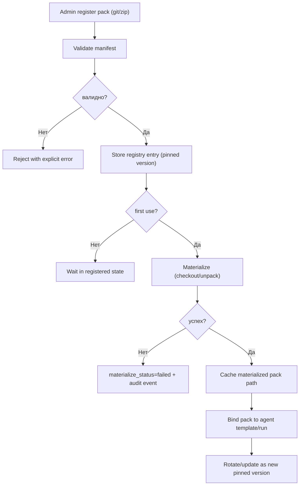

# SCH-09: Pack Lifecycle

## Цель
Подтвердить канонический lifecycle role/capability packs для `git` и `zip` источников.

## Что валидирует
- Формальные шаги `register -> validate -> store -> first-use materialize -> cache -> rotate`.
- Pinned version и запрет неявного version drift.
- Trust policy MVP: только admin upload/register.
- В MVP обязательная криптографическая подпись pack-архивов не требуется.

## Decision table
| Условие | Решение | Событие |
|---|---|---|
| source_type=`git` | checkout pinned commit/tag | `pack.materialized` |
| source_type=`zip` | unpack archive в cache | `pack.materialized` |
| validate failed | не регистрировать активный pack | `pack.validated` (failed) |
| rotate requested | создать новую pinned запись | `pack.rotated` |

## Проверка точности
- [ ] Формат pack не противоречит OpenAPI/Prisma.
- [ ] Для каждого pack фиксируется pinned version.
- [ ] Lazy materialize не нарушает воспроизводимость.
- [ ] Admin-only trust policy отражен явно.

## Границы интерпретации
- Не задает внутренний формат скриптов внутри pack.
- В MVP достаточно checksum + admin-only trust policy без mandatory signature gate.
- Не фиксирует конкретный формат signature для post-MVP.

## Open questions (локально)
- Нужен ли лимит размера ZIP-pack в MVP?
