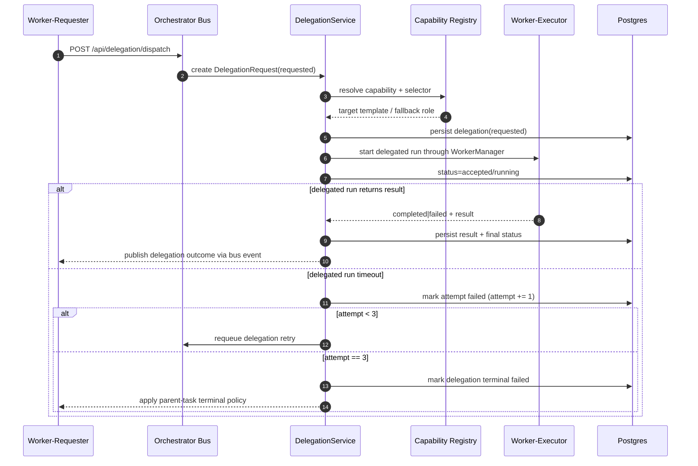

# SCH-10: Delegation Flow

## Цель
Подтвердить, что межагентная делегация выполняется строго через шину (bus-only).

## Что валидирует
- Discovery capabilities через API шины.
- Dispatch, target selection, статусная модель исполнения.
- Явный запрет direct worker-to-worker вызова.
- Timeout-flow делегации с parent-policy и default retry limit.

## Статусы `DelegationRequest`
| Статус | Смысл |
|---|---|
| `requested` | Запрос принят шиной |
| `accepted` | Подобран target и создан delegated run |
| `running` | Выполнение delegated run начато |
| `completed` | Результат возвращен инициатору |
| `failed` | Делегация завершилась ошибкой |
| `cancelled` | Отменено оператором или policy |

## Timeout policy (MVP)
| Условие | Действие |
|---|---|
| timeout и попыток < 3 | retry через шину |
| timeout и попытка = 3 | `failed` (terminal) + parent-task policy |
| policy не задана явно | default: retry до 3, затем terminal failed path |

## Проверка точности
- [ ] Нет worker-to-worker direct канала на диаграмме.
- [ ] Все шаги идут через bus/service слой.
- [ ] События `agent.delegation.*` соответствуют контрактам.
- [ ] Traceability до parent task/run сохранен.
- [ ] Timeout-flow и default retry limit (=3) описаны однозначно.

## Границы интерпретации
- Не задает алгоритм priority inversion между делегациями.
- Не описывает UI-детали отображения дерева делегаций.

## Open questions (локально)
- Нужна ли стратегия "escalate to human" при repeated delegation failure?
