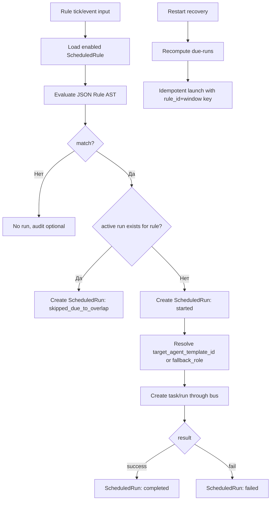

# SCH-11: Schedule Evaluation Flow

## Цель
Подтвердить исполнимость Hybrid Rule Model (`time + event + state/limit`) и политику overlap/misfire.

## Что валидирует
- JSON Rule AST как канонический DSL.
- Разделение `global` и `project` scope.
- overlap policy и restart recovery.
- UTC-семантику для `time.*` predicates.
- Отсутствие отдельного cooldown-поля (cooldown задается через AST).



## Пример JSON Rule AST (минимум)
```json
{
  "all": [
    { "predicate": "time.cron", "value": "0 * * * *" },
    { "predicate": "limit.weekly_remaining_gt", "operator": "gt", "value": 5 },
    { "predicate": "state.module_enabled", "operator": "eq", "value": "switch_chatgpt_auth_on_limit" }
  ]
}
```

## Decision table
| Условие | Результат |
|---|---|
| AST match=false | запуск не производится |
| match=true + active run exists | `skipped_due_to_overlap` |
| match=true + no active run | `started` -> `completed/failed` |
| restart detected | due-runs пересчитываются и запускаются идемпотентно |
| `time.cron` predicate | вычисляется в UTC |
| cooldown требуется | реализуется predicate-логикой AST, без отдельного поля в модели |

## Проверка точности
- [ ] AST поддерживает `all/any/not` без противоречий.
- [ ] Overlap policy однозначна (`one_active_skip`).
- [ ] Scope `global/project` отражен в модели.
- [ ] Misfire recovery согласован с Prisma/OpenAPI/events.

## Границы интерпретации
- Не фиксирует engine cron-библиотеку.
- Не задает бизнес-приоритеты между разными правилами.
- Не вводит отдельный `cooldown` атрибут правила в MVP.

## Open questions (локально)
- Нужно ли добавлять отдельный rate-limit на количество triggered runs в минуту?
