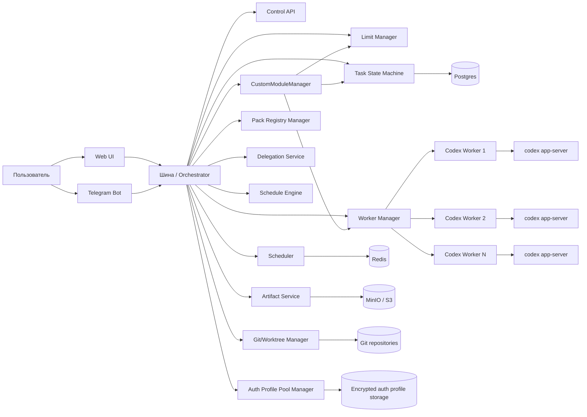
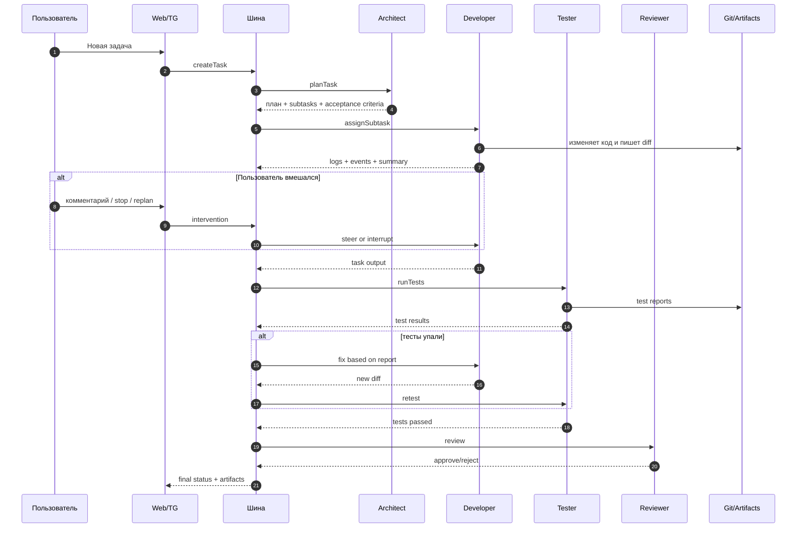

# Техническое задание
## Система оркестрации Codex-воркеров для почти полностью автономной domain-agnostic разработки

Версия: 1.2  
Язык документа: русский  
Тип документа: продуктово-техническое ТЗ + проектный blueprint MVP → production

---

## 1. Краткое описание

Разработать систему-оркестратор («Шина»), которая управляет специализированными Codex-воркерами через `codex app-server`, предоставляет единый личный кабинет и Telegram-интерфейс для постановки, наблюдения и корректировки задач, анализирует лимиты и состояние auth-контекстов, удерживает запуск новых задач при limit pressure, поддерживает role/capability packs, межагентную делегацию через bus и scheduled запуски по гибридным правилам, а также ведет полное логирование и журналирование разработки.

Система должна стать основой для почти полностью автономной фабрики разработки domain-agnostic продуктов, где пользователь задает цели и при необходимости вмешивается через web/TG, но не обязан участвовать в каждом шаге pipeline.

---

## 2. Цели системы

### 2.1. Бизнес-цели
- Ускорить выпуск MVP и внутренних продуктов.
- Снизить долю ручной рутины в разработке, тестировании и документации.
- Построить управляемый многоагентный конвейер разработки.
- Получить платформу для эксперимента: запуск нескольких продуктовых конвейеров (SaaS и не только) с минимально необходимым ручным участием.

### 2.2. Технические цели
- Управлять Codex как рантаймом, а не как одиночным CLI-инструментом.
- Стандартизировать создание, запуск, паузу, остановку, возобновление и перепланирование задач.
- Отделить control plane (логика шины) от worker runtime (Codex-воркеры).
- Обеспечить воспроизводимость, наблюдаемость, аудит и изоляцию выполнения.
- Встроить limit-aware scheduler.
- Встроить bus-only межагентную делегацию (worker-to-worker напрямую запрещено).
- Поддержать role/capability packs с pinned-version и lazy materialize.
- Поддержать гибридные запуски агентов по расписанию (time + event + state/limit).

### 2.3. Ограничения
- Система не должна использовать неконтролируемую ротацию аккаунтов как механизм обхода ограничений.
- Система может выполнять контролируемое переключение auth-контекста только для **новых** задач через явно включенный кастомный модуль, с полным аудитом.
- Система должна удерживать задачи при limit pressure, а не «проталкивать» их серыми способами.
- Система не должна полагаться только на историю чатов как на источник истины.
- Должна сохраняться возможность human override через Web/TG, но обязательные gate-паузы по умолчанию отключены.

---

## 3. Предметная модель

### 3.1. Основная идея
Система состоит из:
- **Шины / оркестратора** — deterministic backend, который управляет задачами, лимитами, очередями, состояниями и воркерами.
- **Codex-воркеров** — процессов/контейнеров с `codex app-server`, исполняющих конкретную роль.
- **Хранилищ** — БД, очереди, git/worktree, артефакты.
- **Каналов управления** — веб-интерфейс, Telegram-бот, API.

### 3.2. Ключевые роли
Минимальный набор ролей для MVP:
- `architect`
- `developer`
- `tester`
- `reviewer`

Расширенный набор:
- `backend_dev`
- `frontend_dev`
- `qa_tester`
- `security_reviewer`
- `devops`
- `docs_writer`
- `product_analyst`

### 3.3. Принцип работы
Пользователь ставит задачу → шина формирует карточку задачи → planner/architect разбивает задачу на этапы → scheduler назначает роль и воркер → воркер выполняет turn → при необходимости воркер запрашивает делегацию **только через шину** → шина получает поток событий и артефактов → при необходимости пользователь вмешивается через web/TG → шина steer/interrupt/replan → далее задача идет на тесты, ревью и финализацию.

---

## 4. Границы решения

### 4.1. Что входит в систему
- Личный кабинет для управления задачами, агентами и лимитами.
- Telegram-бот как альтернативный интерфейс управления.
- Управление Codex-воркерами через `codex app-server`.
- Очереди, планирование и state machine задач.
- Библиотека шаблонов агентов.
- Хранение prompt’ов, инструкций, policies и профилей.
- Полный журнал выполнения задач.
- Ограничение запуска новых задач при limit pressure.
- Управление auth-контекстами.
- Git/worktree интеграция.
- Хранение артефактов.

### 4.2. Что не входит в первую версию
- Автономный поиск product-market fit.
- Автономный маркетинг и продажи.
- Полностью автоматические продуктовые решения без human override.
- Жестко обязательные gate/approval на каждое рискованное действие (в MVP отключены по умолчанию).
- Мультиоблачная оркестрация инфраструктуры на первом этапе.

---

## 5. Высокоуровневая архитектура



### 5.1. Control plane
Сюда входят:
- API Gateway
- Scheduler
- Limit Manager
- Worker Manager
- CustomModuleManager
- Auth Profile Pool Manager
- Pack Registry Manager
- Delegation Service
- Schedule Engine
- Task State Machine
- Telegram Adapter
- Artifact Service
- Audit Log
- Agent Template Registry

### 5.2. Data plane
Сюда входят:
- активные Codex-воркеры
- sandbox/container runtime
- test runner
- локальные worktree
- промежуточные файлы и артефакты
- encrypted auth profile bundles

---

## 6. Основные компоненты

### 6.1. Web UI
Функции:
- дашборд активных задач;
- карточки воркеров;
- лог событий;
- просмотр диффов, отчетов и логов;
- редактор шаблонов агентов;
- экран auth-контекстов;
- настройки политики лимитов;
- экран очереди и таймеров удержания.

### 6.2. Telegram Adapter
Функции:
- постановка задач;
- просмотр статуса;
- отправка уточнений;
- пауза / возобновление;
- принудительная остановка;
- approve/reject шагов;
- подписка на уведомления;
- поддержка работы через proxy для Telegram Bot API в средах с сетевыми блокировками.

### 6.3. Scheduler
Функции:
- выбор следующей задачи;
- учет приоритета;
- учет доступности воркеров;
- учет лимитов;
- учет блокировок по файлам/модулям;
- маршрутизация задачи по ролям.

Guard-правила при работе модуля переключения auth-контекста:
- при `switch_in_progress` не выдавать новые задачи в RUNNING;
- новые задачи переводить в удержание (`WAITING_LIMIT`) с причиной `auth_switch_guard`;
- дождаться завершения активных задач (drain), не прерывая их;
- после переключения и перезапуска warm workers вернуть удержанные задачи в `QUEUED`.

### 6.4. Limit Manager
Функции:
- чтение текущих лимитов;
- хранение limit snapshots;
- включение режимов `normal / degraded / blocked`;
- расчёт `cooldown_until`;
- удержание очереди;
- возвращение задач в очередь после восстановления окна.

### 6.5. Worker Manager
Функции:
- создание runtime-воркеров;
- запуск `codex app-server`;
- инициализация `CODEX_HOME`;
- подготовка рабочей директории;
- назначение auth-контекста;
- управление жизненным циклом worker’а;
- остановка/перезапуск/утилизация воркеров.

### 6.6. Artifact Service
Функции:
- хранение патчей, логов, тест-репортов, скриншотов, summary;
- версия артефактов по task run;
- выдача ссылок в UI;
- архивирование завершенных задач.

### 6.7. Git / Worktree Manager
Функции:
- создание `git worktree` под задачу;
- создание веток;
- блокировки по модулям/путям;
- сбор diff’ов;
- передача изменений на тест и ревью.

### 6.8. CustomModuleManager
Функции:
- реестр встроенных кастомных модулей;
- trigger engine по событиям шины;
- запуск модулей с timeout/retry/backoff;
- execution log и аудит исполнения модулей;
- fail-safe поведение (ошибка модуля не должна терять задачи).

### 6.9. Auth Profile Pool Manager
Функции:
- управление глобальным пулом ChatGPT auth-профилей;
- загрузка ZIP-пакетов auth-профиля через админку;
- валидация, активация/деактивация профилей;
- выдача активного профиля Worker Manager;
- журнал смен профилей и операторских действий.

### 6.10. Pack Registry Manager
Функции:
- регистрация role/capability pack из `git` и `zip`;
- хранение pinned version (`commit`/`tag`/`version`) и source ref;
- lifecycle `register -> validate -> store -> first-use materialize -> cache -> rotate/update`;
- lazy materialize при первом использовании;
- trust policy MVP: только admin upload/register.

### 6.11. Delegation Service (через шину)
Функции:
- discovery доступных capabilities и agent templates;
- dispatch подзадач через bus (`request -> accept -> execute -> complete`);
- запрет прямого worker-to-worker вызова;
- аудит делегированных запусков и результатов.

### 6.12. Schedule Engine
Функции:
- хранение и исполнение правил запуска агентов (`global` + `project`);
- Hybrid Rule Model: `time + event + state/limit`;
- Rule DSL: JSON Rule AST (`all` / `any` / `not` + typed predicates);
- overlap policy: только один активный run на правило, overlap -> `skipped_due_to_overlap`;
- misfire/recovery после рестарта (пересчет due-runs и идемпотентный запуск).

---

## 7. Технический стек

### 7.1. Рекомендуемый стек MVP
- Backend: **Node.js + TypeScript**
- Web UI: **Next.js / React**
- DB: **Postgres**
- Queue/locks: **Redis**
- Runtime isolation: **Docker**
- Object storage: **MinIO / S3**
- SCM: **Git**
- Message/event streaming: **Redis Streams** (MVP)
- Telegram: **Bot API**

### 7.2. Рекомендуемый стек production
- Backend: Node.js + TS
- API schema: OpenAPI + zod (MVP/production baseline)
- Worker orchestration: Docker + Nomad/K8s (по мере роста)
- Tracing: OpenTelemetry + Grafana/Tempo
- Metrics: Prometheus + Grafana
- Logs: Loki / ELK

---

## 8. Модель сущностей

### 8.1. AgentTemplate
Хранит шаблон агента.

Поля:
- `id`
- `name`
- `role`
- `description`
- `model`
- `auth_context_id`
- `system_prompt`
- `instructions_md`
- `sandbox_policy`
- `approval_policy`
- `cwd_policy`
- `input_schema`
- `output_schema`
- `is_enabled`
- `created_at`
- `updated_at`

### 8.2. WorkerInstance
Хранит конкретный runtime.

Поля:
- `id`
- `agent_template_id`
- `status`
- `runtime_mode` (`ondemand`, `warm_pool`, `dedicated`)
- `codex_home_path`
- `workspace_path`
- `cwd`
- `thread_id`
- `current_task_id`
- `pid/container_id`
- `started_at`
- `last_heartbeat_at`
- `stopped_at`

### 8.3. AuthContext
Хранит auth-контекст.

Поля:
- `id`
- `label`
- `type` (`apikey`, `chatgpt`, `chatgptAuthTokens`)
- `provider`
- `usage_policy`
- `limit_policy`
- `is_enabled`
- `notes`
- `created_at`
- `updated_at`

### 8.4. Task
Хранит основную задачу.

Поля:
- `id`
- `title`
- `description`
- `source` (`web`, `telegram`, `api`, `webhook`)
- `project_id`
- `repo_id`
- `branch`
- `priority`
- `requested_pipeline`
- `status`
- `created_by`
- `created_at`
- `updated_at`

### 8.5. Subtask
Хранит подзадачу.

Поля:
- `id`
- `task_id`
- `parent_subtask_id`
- `role_required`
- `title`
- `acceptance_criteria`
- `depends_on`
- `status`
- `position`

### 8.6. TaskRun
Хранит один запуск задачи конкретным воркером.

Поля:
- `id`
- `task_id`
- `subtask_id`
- `worker_instance_id`
- `thread_id`
- `turn_id`
- `status`
- `input_summary`
- `result_summary`
- `started_at`
- `ended_at`
- `token_estimate`
- `cost_estimate`

### 8.7. Artifact
Поля:
- `id`
- `task_id`
- `task_run_id`
- `type` (`diff`, `patch`, `log`, `test_report`, `screenshot`, `summary`, `trace`)
- `path`
- `meta_json`
- `created_at`

### 8.8. Intervention
Поля:
- `id`
- `task_id`
- `task_run_id`
- `source`
- `type` (`steer`, `interrupt`, `pause`, `resume`, `replan`, `approve`, `reject`)
- `payload`
- `created_by`
- `created_at`

### 8.9. LimitSnapshot
Поля:
- `id`
- `auth_context_id`
- `model`
- `used_percent`
- `window_duration_mins`
- `resets_at`
- `cooldown_until`
- `status`
- `captured_at`

### 8.10. FileLock
Поля:
- `id`
- `project_id`
- `repo_id`
- `path_pattern`
- `task_id`
- `worker_instance_id`
- `created_at`
- `expires_at`

### 8.11. CustomModuleConfig
Поля:
- `id`
- `module_key` (например, `switch_chatgpt_auth_on_limit`)
- `is_enabled`
- `scope` (`global`)
- `config_json`
- `updated_by`
- `created_at`
- `updated_at`

### 8.12. ChatGptAuthProfile
Поля:
- `id`
- `label`
- `status` (`active`, `inactive`, `blocked`)
- `storage_path`
- `checksum`
- `meta_json`
- `uploaded_by`
- `activated_by`
- `created_at`
- `updated_at`

### 8.13. AuthSwitchEvent
Поля:
- `id`
- `module_key`
- `from_auth_profile_id`
- `to_auth_profile_id`
- `reason` (`limit_pressure`, `manual`)
- `switch_scope` (`global`)
- `status` (`started`, `completed`, `failed`, `skipped`)
- `details_json`
- `started_at`
- `ended_at`

### 8.14. ScheduledRule
Поля:
- `id`
- `name`
- `scope` (`global`, `project`)
- `project_id` (nullable, обязателен для `project`)
- `is_enabled`
- `rule_ast` (JSON Rule AST: `all` / `any` / `not` + typed predicates)
- `target_agent_template_id` (nullable)
- `fallback_role` (nullable)
- `overlap_policy` (`one_active_skip`)
- `misfire_policy` (`recompute_due_on_restart`)
- `created_by`
- `created_at`
- `updated_at`

### 8.15. ScheduledRun
Поля:
- `id`
- `rule_id`
- `created_task_id` (nullable)
- `status` (`started`, `completed`, `failed`, `skipped_due_to_overlap`)
- `started_at`
- `ended_at`
- `skip_reason`
- `trace_id`
- `idempotency_key`
- `result_json`

### 8.16. PackRegistryEntry
Поля:
- `id`
- `pack_id`
- `role`
- `capabilities_json`
- `source_type` (`git`, `zip`)
- `source_ref`
- `pinned_version`
- `manifest_json`
- `materialize_status` (`registered`, `materialized`, `failed`)
- `cached_path`
- `is_enabled`
- `registered_by`
- `created_at`
- `updated_at`

### 8.17. DelegationRequest
Поля:
- `id`
- `requester_task_id`
- `requester_task_run_id` (nullable)
- `capability`
- `target_selector_json`
- `payload_json`
- `priority`
- `status` (`requested`, `accepted`, `running`, `completed`, `failed`, `cancelled`)
- `target_agent_template_id` (nullable)
- `target_worker_instance_id` (nullable)
- `result_summary`
- `trace_id`
- `created_at`
- `started_at`
- `ended_at`

---

## 9. Папочная структура runtime

### 9.1. Структура worker’а
```text
/workers
  /architect-001
    /home
    /workspace
    /artifacts
    /logs
    /config
  /developer-004
    /home
    /workspace
    /artifacts
    /logs
    /config
  /tester-002
    /home
    /workspace
    /artifacts
    /logs
    /config
```

### 9.2. Назначение директорий
- `home` — изолированный `CODEX_HOME`
- `workspace` — рабочая директория задачи
- `artifacts` — промежуточные артефакты
- `logs` — внутренние логи воркера
- `config` — генерируемые конфиги воркера

---

## 10. Жизненный цикл задачи

### 10.1. Базовый сценарий


### 10.2. Состояния задачи
```text
NEW
QUEUED
ASSIGNED
STARTING
RUNNING
WAITING_APPROVAL
WAITING_LIMIT
DRAINING_ACTIVE
SWITCHING_AUTH
WAITING_USER
INTERRUPTING
INTERRUPTED
REPLANNING
BLOCKED
FAILED_RETRYABLE
FAILED_TERMINAL
DONE
ARCHIVED
```

### 10.3. Переходы между состояниями
- `NEW -> QUEUED`
- `QUEUED -> ASSIGNED`
- `ASSIGNED -> STARTING`
- `STARTING -> RUNNING`
- `RUNNING -> WAITING_APPROVAL`
- `RUNNING -> WAITING_USER`
- `RUNNING -> WAITING_LIMIT`
- `WAITING_LIMIT -> DRAINING_ACTIVE`
- `DRAINING_ACTIVE -> SWITCHING_AUTH`
- `SWITCHING_AUTH -> QUEUED`
- `RUNNING -> INTERRUPTING`
- `INTERRUPTING -> INTERRUPTED`
- `INTERRUPTED -> REPLANNING`
- `REPLANNING -> QUEUED`
- `RUNNING -> FAILED_RETRYABLE`
- `FAILED_RETRYABLE -> WAITING_LIMIT`
- `FAILED_RETRYABLE -> QUEUED`
- `WAITING_APPROVAL -> RUNNING` (approve)
- `WAITING_APPROVAL -> REPLANNING` (reject)
- `WAITING_USER -> RUNNING`
- `WAITING_LIMIT -> QUEUED` (без switch после восстановления лимитов)
- `BLOCKED -> QUEUED` (после снятия блокировки)
- `FAILED_TERMINAL -> ARCHIVED`
- `RUNNING -> DONE`
- `DONE -> ARCHIVED`

---

## 11. Политика вмешательства пользователя

### 11.1. Каналы вмешательства
- Web UI
- Telegram Bot
- Internal Admin API

### 11.2. Типы вмешательства
- **Steer** — добавить уточнение в текущий контекст
- **Interrupt** — остановить текущий turn
- **Pause** — заморозить задачу на стороне шины
- **Resume** — возобновить выполнение
- **Replan** — остановить и перепланировать задачу
- **Approve / Reject** — разрешить или отклонить переход на следующий этап

### 11.3. Правила
- Если активен текущий turn и требуется уточнение — использовать `steer`.
- Если пользователь пишет «стоп» или обнаружен критический уход не туда — использовать `interrupt`.
- Если нужно сменить стратегию, роль, модель, набор файлов или pipeline — делать `interrupt + replan`.
- Любое пользовательское вмешательство должно логироваться и быть видимым в ленте событий.

---

## 12. Политика лимитов

### 12.1. Цель
Предотвратить запуск новых задач или тяжелых turn’ов, когда auth-контекст приближается к пределам или уже вошел в limit pressure.

### 12.2. Режимы лимитов
- `NORMAL`
- `DEGRADED`
- `BLOCKED`

### 12.3. Рекомендуемая политика
- дефолтные пороги для модуля переключения:
  - `weekly_remaining_percent < 5%` **или** `five_hour_remaining_percent < 10%`;
  - не переключать аккаунт, если ближайший reset наступит менее чем через `3` часа;
- при явном limit error / 429 — переводить новые задачи в `WAITING_LIMIT`;
- активные задачи не прерывать, а дожидаться их завершения (drain);
- переключение возможно только при включенном кастомном модуле и наличии eligible профиля.

### 12.4. Что должна делать шина
- периодически опрашивать лимиты через provider API и сохранять snapshots;
- при limit pressure удерживать **новые** задачи в `WAITING_LIMIT`;
- при включенном модуле переключения запускать последовательность:
  - `WAITING_LIMIT -> DRAINING_ACTIVE` (дождаться завершения активных);
  - `DRAINING_ACTIVE -> SWITCHING_AUTH` (глобальный switch профиля);
  - recycle warm workers;
  - release удержанной очереди в `QUEUED`;
- показывать пользователю таймеры reset/hold и причину удержания;
- отправлять уведомления о hold/switch/resume в Web UI и Telegram.

### 12.5. Что шина не должна делать
- не должна переключать аккаунт для уже активных задач;
- не должна выполнять скрытое переключение без аудита и уведомлений;
- не должна переключать аккаунт, если модуль выключен или правило «скоро reset» запрещает switch;
- не должна скрывать от пользователя, что задача удержана по лимитам.

### 12.6. Практическая логика
```text
if module_disabled:
    if limit_pressure:
        hold_new_tasks()
        wait_for_reset()

if module_enabled and limit_pressure:
    hold_new_tasks()
    if reset_eta_hours < 3:
        wait_for_reset()
    else:
        wait_until_active_tasks_finished()   # DRAINING_ACTIVE
        candidate = select_profile_with_max_remaining_limits()
        if candidate:
            switch_global_auth_profile(candidate)  # SWITCHING_AUTH
            recycle_warm_workers()
            release_held_tasks_to_queue()
        else:
            stay_in_waiting_limit()

emit_audit_and_notifications()
```

---

## 13. Политика auth-контекстов

### 13.1. Подход
Система должна управлять **auth-контекстами**, а не абстрактными «аккаунтами ради ротации».

### 13.2. Типы контекстов
- `API Key / Project`
- `ChatGPT`
- `ChatGPT token broker` (если будет отдельная внутренняя обвязка)

### 13.3. Правила использования
- каждый worker должен иметь строго один auth-контекст;
- auth-контекст привязывается к agent template или pool policy;
- один auth-контекст может быть запрещен для некоторых ролей;
- production-режим желательно строить на API key / projects;
- worker с ChatGPT auth должен иметь изолированный `CODEX_HOME`.

### 13.4. Допустимый runtime-подход
- разные пулы под разные проекты, среды и бюджеты;
- разные auth-контексты под разные классы задач;
- прозрачное отображение, какой контекст обслуживает какую задачу.

### 13.5. Глобальный пул ChatGPT auth-профилей (MVP)
- охват MVP: только `ChatGPT auth`;
- scope переключения: `global` на всю шину;
- источник профилей: ZIP-пакеты, загружаемые через админку;
- хранение: encrypted файлы + метаданные в БД;
- для новых задач используется только текущий `active` профиль;
- при switch активные задачи не переводятся на новый профиль, а завершаются на текущем;
- после switch все warm workers перезапускаются и поднимаются с новым профилем.

---

## 14. Управление агентами

### 14.1. Создание шаблона агента
При создании шаблона нужно задавать:
- имя
- роль
- описание
- системный prompt
- дополнительные инструкции
- модель
- auth-контекст
- sandbox policy
- approval policy
- output schema
- разрешенные инструменты
- `pack_registry_entry_id` (ссылка на pinned role/capability pack)
- `capability_overrides` (опциональный override манифеста pack)

### 14.2. Создание runtime-агента
При запуске runtime-агента шина должна:
1. Создать запись `WorkerInstance`.
2. Выделить `CODEX_HOME`.
3. Выделить `workspace`.
4. Сгенерировать локальный config.
5. Привязать auth-контекст.
6. Запустить `codex app-server`.
7. Пройти handshake.
8. Начать `thread/turn` по задаче.

### 14.3. Стратегии life cycle
- **On-demand worker** — создается под конкретную задачу
- **Warm pool worker** — держится живым ограниченное время
- **Dedicated worker** — закреплен за проектом/ролью

### 14.4. Рекомендация для MVP
- architect: warm pool (1 шт.)
- developer: on-demand или warm pool (1–2 шт.)
- tester: on-demand
- reviewer: on-demand

### 14.5. Кастомные модули (MVP v1.2)
В MVP модули встроенные (in-process), но через расширяемый каркас `CustomModuleManager`.

Типы триггеров:
- `limit.updated`
- `task.created`
- `task.status_changed`
- `worker.stopped`

Контракт модуля:
- `onEvent(event, context) -> ModuleDecision`
- `ModuleDecision` может содержать: `hold_new_tasks`, `start_switch`, `no_action`, `emit_notification`, `emit_audit`.

Runtime-политика:
- timeout выполнения модуля: `30s` (дефолт);
- retries: до `3` попыток с exponential backoff;
- идемпотентность на уровне `event_id + module_key`;
- fail-safe: ошибка модуля не должна ронять шину или терять задачи.

MVP-модуль:
- `switch_chatgpt_auth_on_limit` — удерживает новые задачи, дожидается drain активных, выбирает eligible профиль с максимальным остатком лимитов, переключает глобальный active профиль, перезапускает warm workers, возвращает удержанные задачи в `QUEUED`.

### 14.6. Role/Capability Pack format (MVP v1.2)
Цель: убрать импровизацию в рантайме и привязать агента к явному пакету возможностей.

Источники pack:
- `git` (url + pinned commit/tag);
- `zip` (admin upload).

Режимы и правила:
- хранение в админском registry;
- строго pinned version (`commit` / `tag` / `version`);
- `lazy materialize`: unpack/checkout только при первом использовании;
- materialized pack кэшируется и переиспользуется;
- update/rotate выполняется как новая pinned-версия без неявного inplace-override.

Trust policy MVP:
- только admin upload/register;
- checksum фиксируется для диагностики/целостности, но не является обязательной trust-signature политикой MVP.

Минимальный pack manifest (`json/yaml`):
- `id`, `version`, `role`;
- `capabilities`;
- `scripts` (entrypoints);
- `required_tools` / `required_mcp`;
- `sandbox_hints`;
- `dependencies`;
- `compatibility`.

### 14.7. Межагентная делегация через шину
Базовый принцип:
- агент не может вызвать другого агента напрямую;
- делегация выполняется только через bus API и очереди шины.

Поток делегации:
1. Агент публикует запрос `DelegationRequest` с `capability` и `target_selector`.
2. Шина выбирает target (`agent_template_id` или fallback по роли/capability).
3. Создается делегированный запуск в отдельном `TaskRun`/worker-контексте.
4. Результат публикуется обратно в исходную задачу и audit log.

### 14.8. Запуск агентов по расписанию (Hybrid Rule Model)
Модель правил:
- Rule DSL: JSON Rule AST (`all` / `any` / `not` + typed predicates);
- источники триггеров: `time`, `event`, `state/limit`;
- scope: `global` и `project`.

Политика конкурентности:
- один активный run на правило;
- overlap -> `skipped_due_to_overlap` с audit/event.

Misfire/recovery:
- после рестарта выполняется пересчет due-runs;
- запуск идемпотентный через `rule_id + window` ключ.

---

## 15. Git и управление изменениями

### 15.1. Основные требования
- каждая задача должна работать в отдельном `git worktree`;
- изменение кода без worktree запрещено;
- все изменения должны быть привязаны к задаче;
- diff и patch должны сохраняться в артефактах;
- параллельные задачи не должны без контроля править одни и те же файлы.

### 15.2. Политика блокировок
- lock на критические модули;
- lock на migrations;
- lock на infra manifests;
- lock TTL с обновлением heartbeat.

### 15.3. Этапы
- checkout base branch
- create worktree
- create task branch
- run worker
- collect diff
- pass to test/review
- merge вручную или автоматически по runtime-политике проекта (без обязательного gate по умолчанию)

---

## 16. Тестовый пайплайн разработки

### 16.1. Рекомендуемый pipeline MVP
1. Intake
2. Planning
3. Coding
4. Testing
5. Review
6. Finalize

### 16.2. Детализация
#### Этап 1. Intake
- пользователь создает задачу;
- шина валидирует входные данные;
- создается карточка задачи.

#### Этап 2. Planning
- architect анализирует задачу;
- создает подзадачи;
- выделяет зоны риска;
- формирует acceptance criteria;
- определяет затрагиваемые модули.

#### Этап 3. Coding
- developer получает только релевантный контекст;
- работает в изолированном worktree;
- формирует summary;
- публикует diff.

#### Этап 4. Testing
- tester запускает unit/integration/e2e/lint/build;
- собирает лог;
- создает test report.

#### Этап 5. Review
- reviewer проверяет:
  - соответствие acceptance criteria;
  - scope discipline;
  - наличие рисков;
  - качество изменений.

#### Этап 6. Finalize
- задача завершается;
- summary сохраняется;
- артефакты архивируются;
- ветка либо идет на merge, либо возвращается на доработку.

### 16.3. Расширенный pipeline
- Product analysis
- Architecture
- Backend
- Frontend
- Testing
- Security review
- Docs
- DevOps / release

---

## 17. UX личного кабинета

### 17.1. Главный экран
Виджеты:
- активные задачи;
- очередь;
- лимиты по контекстам;
- активные воркеры;
- последние ошибки;
- ближайшие удержанные задачи;
- статус модуля переключения auth;
- текущий active ChatGPT auth-профиль.

### 17.2. Экран задач
Для каждой задачи показывать:
- id
- title
- статус
- текущую роль
- текущего воркера
- auth-контекст
- время старта
- текущий этап
- лог событий
- артефакты
- вмешательства пользователя
- кнопки pause/resume/stop/replan

### 17.3. Экран агентов
Показывать:
- шаблоны агентов;
- активные runtime-агенты;
- профиль;
- модель;
- статус;
- auth-контекст;
- load;
- текущую задачу;
- кнопки disable/restart/view logs.

### 17.4. Экран лимитов
Показывать:
- список auth-контекстов;
- used percent;
- resetsAt;
- статус (`NORMAL/DEGRADED/BLOCKED`);
- очереди, удержанные из-за лимитов;
- политики удержания;
- правило «не переключать, если reset < N часов».

### 17.5. Экран логов
Показывать:
- event timeline;
- turn timeline;
- фильтр по задаче;
- фильтр по агенту;
- фильтр по ошибкам;
- view raw json / human-readable.

### 17.6. Экран кастомного модуля и auth-пула
Показывать:
- флаг включения `switch_chatgpt_auth_on_limit`;
- дефолтные и кастомные пороги срабатывания;
- текущий глобальный active профиль;
- список загруженных ZIP auth-профилей и их статус;
- историю переключений (когда, почему, с какого на какой профиль);
- список удержанных задач во время switch.

### 17.7. Экраны packs / schedules / delegation
Показывать:
- реестр pack-версий (`source_type`, `source_ref`, `pinned_version`, `materialize_status`);
- историю materialize/rotate и связанных ошибок;
- список правил расписаний с AST-предикатами, scope, target/fallback и overlap policy;
- историю scheduled runs, включая `skipped_due_to_overlap`;
- журнал делегаций между агентами (requested/accepted/completed/failed);
- явный признак, что прямой worker-to-worker вызов запрещен политикой шины.

---

## 18. Telegram Bot: команды

Минимальный набор:
- `/tasks`
- `/task <id>`
- `/say <id> <message>`
- `/pause <id>`
- `/resume <id>`
- `/stop <id>`
- `/replan <id> <message>`
- `/approve <id>`
- `/reject <id>`
- `/logs <id>`
- `/artifacts <id>`
- `/limit`
- `/switch-status`
- `/held`
- `/switch-history`
- `/schedules`
- `/schedule-run <id>`
- `/delegations`

### 18.1. Семантика
- `/say` — уточнить текущий ход работы
- `/pause` — заморозить задачу на стороне шины
- `/resume` — вернуть в очередь / продолжить
- `/stop` — экстренно остановить текущий активный шаг
- `/replan` — остановить и перестроить план
- `/approve` — принудительно разрешить следующий ожидающий переход (если он есть)
- `/reject` — вернуть на пересмотр
- `/limit` — показать текущий статус лимитов и reset timers
- `/switch-status` — показать статус модуля и активный auth-профиль
- `/held` — показать удержанные из-за limit/switch задачи
- `/switch-history` — последние события переключения профиля
- `/schedules` — список активных правил расписаний
- `/schedule-run` — статус конкретного scheduled run
- `/delegations` — последние межагентные делегации

Системные уведомления:
- отправлять в Telegram события `hold_started`, `switch_started`, `switch_completed`, `switch_skipped`, `hold_released`.

### 18.2. Сетевой режим и proxy
- Telegram-адаптер должен поддерживать опциональный runtime-параметр `TG_PROXY_URL`.
- Если `TG_PROXY_URL` задан, запросы адаптера к Telegram Bot API выполняются через proxy.
- Если `TG_PROXY_URL` не задан, используется прямой доступ к Telegram Bot API.
- Если proxy недоступен или настроен некорректно, деградирует только Telegram-канал; управление через Web/API и core state machine остается функциональным.

---

## 19. API шины

### 19.1. HTTP API (пример)
#### Tasks
- `POST /api/tasks`
- `GET /api/tasks`
- `GET /api/tasks/:id`
- `POST /api/tasks/:id/pause`
- `POST /api/tasks/:id/resume`
- `POST /api/tasks/:id/stop`
- `POST /api/tasks/:id/replan`
- `POST /api/tasks/:id/approve`
- `POST /api/tasks/:id/reject`

#### Agent templates
- `POST /api/agents/templates`
- `GET /api/agents/templates`
- `PATCH /api/agents/templates/:id`
- `DELETE /api/agents/templates/:id`

#### Workers
- `GET /api/workers`
- `POST /api/workers/:id/restart`
- `POST /api/workers/:id/disable`
- `GET /api/workers/:id/logs`

#### Auth contexts
- `POST /api/auth-contexts`
- `GET /api/auth-contexts`
- `PATCH /api/auth-contexts/:id`
- `POST /api/auth-contexts/:id/disable`

#### Artifacts
- `GET /api/tasks/:id/artifacts`
- `GET /api/artifacts/:id`

#### Custom modules
- `GET /api/custom-modules`
- `GET /api/custom-modules/:key`
- `PATCH /api/custom-modules/:key` (enable/disable + config)
- `GET /api/custom-modules/:key/executions`

#### ChatGPT auth profiles
- `POST /api/auth-profiles/chatgpt/upload` (ZIP)
- `GET /api/auth-profiles/chatgpt`
- `POST /api/auth-profiles/chatgpt/:id/activate`
- `POST /api/auth-profiles/chatgpt/:id/deactivate`
- `GET /api/auth-profiles/chatgpt/active`
- `GET /api/auth-profiles/chatgpt/switch-events`

#### Queue and hold
- `GET /api/queue/held`
- `POST /api/queue/held/release`

#### Packs
- `POST /api/packs` (register git source JSON или zip upload multipart)
- `GET /api/packs`
- `GET /api/packs/:id`
- `PATCH /api/packs/:id` (enable/disable + rotate pinned version)
- `POST /api/packs/:id/materialize`

#### Delegation
- `GET /api/delegation/capabilities`
- `POST /api/delegation/dispatch`
- `GET /api/delegation/:id`
- `GET /api/delegation/:id/result`

#### Schedules
- `POST /api/schedules`
- `GET /api/schedules`
- `GET /api/schedules/:id`
- `PATCH /api/schedules/:id`
- `DELETE /api/schedules/:id`
- `POST /api/schedules/:id/enable`
- `POST /api/schedules/:id/disable`
- `POST /api/schedules/:id/evaluate` (dry-run)
- `POST /api/schedules/:id/trigger`
- `GET /api/schedules/:id/runs`

### 19.2. Event bus topics (пример)
- `task.created`
- `task.assigned`
- `task.intervention`
- `task.waiting_limit`
- `task.drain_started`
- `task.auth_switching`
- `task.done`
- `worker.started`
- `worker.stopped`
- `worker.event`
- `limit.updated`
- `artifact.created`
- `queue.hold_started`
- `queue.hold_released`
- `module.execution.started`
- `module.execution.completed`
- `module.execution.failed`
- `auth_profile.uploaded`
- `auth_profile.activated`
- `auth_profile.switch.started`
- `auth_profile.switch.completed`
- `auth_profile.switch.skipped`
- `pack.registered`
- `pack.validated`
- `pack.materialized`
- `pack.rotated`
- `schedule.rule.created`
- `schedule.rule.updated`
- `schedule.rule.enabled`
- `schedule.rule.disabled`
- `schedule.run.started`
- `schedule.run.completed`
- `schedule.run.failed`
- `schedule.run.skipped_due_to_overlap`
- `agent.delegation.requested`
- `agent.delegation.accepted`
- `agent.delegation.completed`
- `agent.delegation.failed`

---

## 20. Политика наблюдаемости и аудита

### 20.1. Нужно логировать
- создание задач;
- маршрутизацию задач;
- запуск воркеров;
- все вмешательства пользователя;
- limit snapshots;
- переходы состояний;
- ошибки запуска воркера;
- tool events;
- остановки и перепланирования;
- изменение шаблонов агентов;
- выполнение кастомных модулей (trigger, решение, статус, latency);
- загрузку ZIP auth-профилей;
- активацию/деактивацию auth-профилей;
- события глобального switch auth-профиля и release удержанной очереди;
- registry/lifecycle role packs (register/validate/materialize/rotate);
- события расписаний (rule change, evaluate, run started/completed/skipped);
- события межагентной делегации (requested/accepted/completed/failed).

### 20.2. Форматы логирования
- machine-readable JSON logs
- summarized timeline for UI
- trace id / task id / worker id correlation

### 20.3. Требования к аудиту
- любой task run должен быть воспроизводим по журналу;
- должно быть видно, кто и когда вмешивался;
- должно быть видно, какой auth-контекст обслуживал задачу;
- должно быть видно, почему задача перешла в `WAITING_LIMIT`;
- должно быть видно, кто загрузил auth-пакет, кто активировал профиль и почему выполнен switch;
- должно быть видно, какие задачи были удержаны и когда вернулись в `QUEUED`.

---

## 21. Безопасность

### 21.1. Основные требования
- секреты не должны попадать в prompt’ы без необходимости;
- каждый worker должен быть изолирован;
- обязательные gate/approve по умолчанию отключены, контроль риска обеспечивается runtime-политиками + аудитом;
- risky команды разрешаются/блокируются политикой sandbox для конкретного agent template;
- доступ к auth-контекстам должен быть ролевым;
- ZIP auth-пакеты должны храниться в зашифрованном виде;
- операции upload/activate/switch должны быть доступны только admin-роли.

### 21.2. Sandbox policy
Минимальные уровни:
- `read_only`
- `workspace_write`
- `danger_full_access`

### 21.3. Approval policy
Минимальные режимы:
- auto-approve safe actions
- require approval for shell/network/file outside workspace
- require approval for deploy/infra changes

Политика MVP по умолчанию:
- `approval_mode = auto` (без обязательного gate);
- ручное вмешательство доступно оператору в любой момент через Web/TG.

### 21.4. Рекомендация
Для MVP:
- architect: `read_only` / `workspace_write`
- developer: `workspace_write`
- tester: `workspace_write`
- reviewer: `read_only`
- devops: `workspace_write`/`danger_full_access` по проектной политике, без обязательного gate, но с усиленным аудитом

### 21.5. Защита auth-профилей
- при загрузке ZIP-пакета выполнять валидацию структуры; checksum хранить как технический fingerprint;
- не логировать содержимое auth-файлов в plaintext;
- хранить только технические метаданные профиля в БД;
- обеспечивать быстрый revoke профиля с переводом его в `blocked`.

---

## 22. Производственный режим и автономность

### 22.1. Что реально можно автоматизировать
- разбиение задачи на подзадачи;
- кодинг по четкому scope;
- линтинг, сборку, тесты;
- простое ревью;
- генерацию документации;
- подготовку changelog;
- типовые правки по багрепортам;
- периодические проверки качества по расписанию;
- межагентную делегацию специализированных подзадач через шину.

### 22.2. Где нужен пользователь
- постановка долгосрочных целей и ограничений;
- корректировка политик, packs и расписаний;
- вмешательство при аномалиях или изменении приоритетов.

### 22.3. Вывод
Система проектируется как **почти полностью автономная фабрика**, где человек не обязателен в каждом шаге выполнения, но сохраняет право override и стратегического управления.

---

## 23. Нефункциональные требования

### 23.1. Производительность
- запуск runtime-воркера по задаче: до 15–30 секунд в MVP
- latency на отображение событий в UI: до 2 секунд
- Telegram-команды: обработка до 3 секунд

### 23.2. Надежность
- задачи не должны теряться при рестарте backend’а;
- очередь должна восстанавливаться из БД;
- worker crash не должен ломать весь orchestrator;
- операция switch auth-профиля должна быть идемпотентной;
- hold/switch state должен восстанавливаться после перезапуска;
- при недоступности Telegram или proxy-сервера Web/API и core state machine должны оставаться работоспособными.

### 23.3. Масштабируемость
- шина должна поддерживать горизонтальное масштабирование control plane;
- воркеры должны запускаться независимо друг от друга;
- лимиты должны считаться по auth-контексту, а не по отдельному процессу.

### 23.4. Поддерживаемость
- все политики должны настраиваться через БД/конфиг;
- шаблоны агентов должны редактироваться без перекомпиляции backend’а.

---

## 24. MVP scope

### 24.1. Что обязательно войдет в MVP
- web dashboard
- task queue
- 4 роли: architect / developer / tester / reviewer
- worker manager
- запуск `codex app-server`
- task state machine
- Telegram bot
- limit-aware scheduling
- CustomModuleManager (расширяемый каркас)
- модуль `switch_chatgpt_auth_on_limit`
- глобальный пул ChatGPT auth-профилей (ZIP upload через админку)
- Pack Registry (git+zip, pinned version, lazy materialize)
- bus-only межагентная делегация
- Schedule Engine (hybrid rule model + JSON Rule AST)
- artifact storage
- basic logs
- agent templates CRUD

### 24.2. Что можно отложить
- devops automation
- security review role
- tracing на уровне production APM
- multi-tenant access model
- advanced plugin system
- auto-generated pipeline templates
- поддержка auth-переключения для API key/project контекстов

---

## 25. План реализации по этапам

### Фаза A. Spec Freeze v1.2
- зафиксировать delta-изменения ТЗ по кастомным модулям и auth-switch логике;
- зафиксировать state machine переходы `WAITING_LIMIT -> DRAINING_ACTIVE -> SWITCHING_AUTH -> QUEUED`;
- зафиксировать контракт `CustomModuleManager` и формат audit событий;
- зафиксировать pack manifest, delegation contract и Hybrid Rule Model (JSON Rule AST).

### Фаза B. Module Framework Core
- реализовать `CustomModuleManager` (реестр, trigger engine, runner);
- добавить timeout/retry/backoff и идемпотентность по `event_id + module_key`;
- добавить execution log и базовую диагностику;
- добавить optional PowerShell adapter для вызова внешнего скрипта.

### Фаза C. Auth Profile Pool (ChatGPT)
- реализовать админский API/UI для загрузки ZIP auth-профилей;
- добавить валидацию пакета и статус профиля;
- реализовать активацию/деактивацию профиля;
- привязать Worker Manager к глобальному `active` профилю.

### Фаза D. Limit Provider + Policy Engine
- реализовать сбор лимитов через provider API;
- сохранить snapshots и вычислять режимы `NORMAL/DEGRADED/BLOCKED`;
- реализовать дефолтные пороги (`weekly<5%` или `5h<10%`);
- реализовать правило «не переключать, если reset < 3h».

### Фаза E. Switch Module MVP
- реализовать `switch_chatgpt_auth_on_limit`;
- при pressure удерживать новые задачи в `WAITING_LIMIT`;
- дожидаться завершения активных задач (drain);
- выбирать eligible профиль с max remaining limits;
- выполнять глобальный switch, recycle warm workers, release held queue.

### Фаза F. Control Surfaces (Web/TG/API)
- добавить экран настройки модуля и экраны auth-пула;
- добавить журнал переключений и список удержанных задач;
- добавить Telegram-команды `/limit`, `/switch-status`, `/held`, `/switch-history`;
- добавить системные уведомления `hold/switch/resume`;
- реализовать API/UI для Pack Registry и межагентной делегации.

### Фаза G. Schedules + Delegation Runtime
- реализовать Schedule Engine с JSON Rule AST (time/event/state);
- добавить overlap policy (`one_active_run`, overlap -> `skipped_due_to_overlap`);
- реализовать misfire/recovery пересчет due-runs после рестарта;
- реализовать bus-only delegation flow и запрет worker-to-worker direct вызовов.

### Фаза H. Reliability, Acceptance & Rollout
- защита от гонок и повторного switch;
- recovery после рестарта шины в середине hold/switch/scheduled run/delegation;
- retry/backoff для критичных операций;
- fail-safe: отсутствие потери задач при ошибках модуля, switch, schedule или delegation;
- прогон обязательных тест-сценариев;
- подготовка runbook для эксплуатации;
- включение сначала в наблюдаемом режиме, затем в полном;
- фиксация метрик стабильности и времени восстановления.

---

## 26. Acceptance criteria MVP

Примечание: целевая формулировка «проект на 90% готов» не используется как формальный KPI/DoD в MVP.

MVP считается готовым, если:
1. Пользователь может создать задачу через web.
2. Задача проходит этапы planning → coding → testing → review.
3. Для задачи создается отдельный worker runtime.
4. В UI видны статусы, лог, артефакты и текущий агент.
5. Через Telegram можно отправить уточнение в активную задачу.
6. Через Telegram можно остановить задачу.
7. При высоком limit pressure шина удерживает новые задачи.
8. После восстановления окна задача продолжает выполнение.
9. В системе можно создать и сохранить новый шаблон агента.
10. Для каждой задачи сохраняется полный журнал выполнения.
11. В системе есть `CustomModuleManager` и включаемый модуль `switch_chatgpt_auth_on_limit`.
12. Через админку можно загрузить ZIP auth-профиль, активировать/деактивировать его и видеть историю смен.
13. При switch активные задачи не прерываются, новые удерживаются до завершения drain.
14. После switch warm workers перезапускаются и поднимаются на новом active профиле.
15. Все события hold/switch/resume доступны в Web UI и Telegram, а также в audit log.
16. В системе есть Pack Registry с pinned-version и lazy materialize для role/capability packs.
17. Делегация между агентами выполняется только через шину; direct worker-to-worker вызов отсутствует.
18. Для правил расписаний поддерживаются `time + event + state/limit` условия через JSON Rule AST.
19. Overlap scheduled runs корректно помечается `skipped_due_to_overlap`.
20. В средах с блокировкой Telegram бот поддерживает работу через `TG_PROXY_URL`; при отказе proxy Telegram-канал деградирует без влияния на Web/API и core state machine.

### 26.1. Обязательные тестовые сценарии
1. Лимит выше порога: модуль не срабатывает, новые задачи идут штатно.
2. Лимит ниже порога: новые задачи переходят в `WAITING_LIMIT`, активные продолжаются.
3. Активные завершились: выполняется switch на eligible-аккаунт с максимальным остатком лимитов.
4. После switch warm workers перезапущены и используют новый auth-профиль.
5. Удержанные задачи возвращаются в очередь и стартуют на новом аккаунте.
6. Нет eligible-аккаунта: система остаётся в `WAITING_LIMIT` и отправляет Web+TG уведомления.
7. Если до reset мало времени (`<3h`), switch не выполняется.
8. Рестарт шины в середине удержания/switch не приводит к потере задач.
9. Некорректный ZIP auth-профиль отклоняется с понятной ошибкой.
10. Полный аудит содержит причины hold/switch, инициатора и затронутые задачи/профили.
11. Правило расписания с overlap не стартует второй run и фиксируется как `skipped_due_to_overlap`.
12. После рестарта due-runs корректно пересчитываются и запускаются идемпотентно.
13. Делегация подзадачи через capability завершается результатом или ошибкой с traceability в audit.
14. В среде с блокировкой Telegram и валидным `TG_PROXY_URL` команды/уведомления Telegram работают штатно.
15. При невалидном или недоступном `TG_PROXY_URL` Telegram-канал предсказуемо деградирует, Web/API и core state machine продолжают работу.

---

## 27. Риски

### 27.1. Технические риски
- нестабильность поведения агента при длинных задачах;
- конфликт изменений между несколькими воркерами;
- перегрев лимитов;
- накопление больших контекстов;
- сложности с дебагом при множестве параллельных задач;
- гонки при глобальном switch auth-профиля;
- неконсистентный recycle warm workers при аварийном переключении.

### 27.2. Продуктовые риски
- пользователь завысит ожидания автономности;
- генерация «много кода, мало результата»;
- недостаточная дисциплина acceptance criteria;
- неподготовленная тестовая среда;
- перегрузка системы шумными задачами.

### 27.3. Операционные риски
- секреты попадут не туда;
- воркер получит лишние права;
- ресурсный перерасход;
- неудачная попытка автоматизировать релиз без корректной runtime-policy и аудита;
- загрузка некорректного ZIP auth-профиля;
- человеческая ошибка при активации не того профиля.

---

## 28. Рекомендации по эксплуатации

- Начинать с одного домена задач и одного базового шаблона pack-ролей.
- Не запускать сразу несколько больших продуктов на первом этапе.
- Строить library of reusable agent templates.
- Для каждой роли сделать короткие, строгие инструкции.
- Не заставлять всех агентов читать всю историю проекта.
- Передавать агентам summary + artifacts + релевантные файлы.
- Планировать задачи короткими итерациями.
- Делать явные acceptance criteria для каждой подзадачи.

---

## 29. Рекомендации по первой продуктовой стратегии (domain-agnostic)

Для первого реального эксперимента лучше взять один типовой шаблон конвейера:
- intake/planning pack;
- coding pack;
- testing pack (включая кликер/скриншоты при необходимости);
- review/reporting pack;
- release/ops pack.

Потом на базе этих pack-блоков запускать вариации продукта в разных доменах, а не собирать фундамент с нуля.

---

## 30. Итого

Нужно построить не «коллектив равноправных агентов», а **управляемую производственную систему**, в которой:
- шина — deterministic control plane;
- Codex — исполняющий runtime;
- агентные роли — конфигурируемые профили;
- задачи движутся по pipeline;
- пользователь вмешивается через web/TG;
- лимиты контролируются централизованно;
- журнал и артефакты доступны в UI;
- система масштабируется постепенно от MVP к production.

Это реалистичный путь к почти полностью автономному domain-agnostic конвейеру, который сокращает ручную нагрузку, сохраняя за пользователем стратегическое управление и право override.

---

## 31. Приложение A. Пример политики очереди

```text
Priority order:
1. manual user interventions
2. tasks awaiting approval resolution
3. short critical bugfix tasks
4. active pipeline continuation tasks
5. new heavy tasks
6. background documentation tasks

Queue guards:
- if auth_context.status == BLOCKED: no new turns
- if auth_context.status == DEGRADED: only short tasks
- if switch_module.enabled and limit_pressure: hold new tasks in WAITING_LIMIT
- if switch_module.state == DRAINING_ACTIVE: do not start any new tasks
- if switch_module.state == SWITCHING_AUTH: recycle warm workers, then release held queue
- if project has file locks conflict: requeue task
- if worker crashed: mark FAILED_RETRYABLE and recreate worker
```

---

## 32. Приложение B. Пример карточки задачи

```yaml
task_id: TASK-2026-00041
title: Добавить endpoint health/details и покрыть тестами
status: WAITING_LIMIT
current_role: developer
current_worker: developer-004
project: saas-template-core
repo_branch: feature/task-41-health-details
auth_context: chatgpt-global-pool
active_auth_profile: chatgpt-profile-03
limit_status: DEGRADED
hold_reason: switch_chatgpt_auth_on_limit
artifacts:
  - diff.patch
  - task-summary.md
  - build.log
interventions:
  - 2026-04-06 15:21 /say "не меняй auth слой"
switch_events:
  - 2026-04-06 16:05 hold_started
  - 2026-04-06 16:32 switch_completed from profile-01 to profile-03
```

---

## 33. Приложение C. Пример карточки агента

```yaml
agent_template_id: AGENT-DEVELOPER-BACKEND-01
name: Backend Developer Standard
role: developer
model: gpt-5.4
sandbox_policy: workspace_write
approval_policy: require_for_network_and_outside_workspace
auth_context_id: chatgpt-global-pool
cwd_policy: project_worktree
instructions:
  - работай только в пределах acceptance criteria
  - не делай лишний рефакторинг
  - всегда запускай тесты для затронутой области
  - публикуй краткий summary после завершения turn
```

---

## 34. Приложение D. Опорные официальные материалы

Ниже список материалов, на которые стоит ориентироваться при реализации:

- Codex App Server: <https://developers.openai.com/codex/app-server/>
- Codex Authentication: <https://developers.openai.com/codex/auth/>
- Codex Advanced Configuration: <https://developers.openai.com/codex/config-advanced/>
- Codex SDK: <https://developers.openai.com/codex/sdk/>
- Codex CLI Features: <https://developers.openai.com/codex/cli/features/>
- Run long horizon tasks with Codex: <https://developers.openai.com/blog/run-long-horizon-tasks-with-codex/>
- Code generation / Codex overview: <https://developers.openai.com/api/docs/guides/code-generation/>
- OpenAI Terms of Use: <https://openai.com/policies/row-terms-of-use/>

---

## 35. Приложение E. Рекомендуемое следующее действие

После согласования этого ТЗ логично сделать следующий документ:
- **Технический дизайн MVP**, где будут:
  - схема БД с SQL;
  - контракты API;
  - структура Redis keys;
  - формат событий;
  - схема запуска worker’а;
  - контракт CustomModuleManager и формат ModuleDecision;
  - дизайн хранения/валидации ZIP auth-профилей;
  - алгоритм `hold -> drain -> switch -> release`;
  - список экранов UI;
  - план разработки по неделям.
